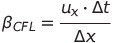

# Exercise 7
This repository is used to stock the codes (MATLAB and C++) as well as the simulation results (.gif, .jpg and .eps).

## Nomenclature
In the ./gifs/ folder, the coefficient CFL's value is 1.00 by default, except if a file contains "1.94", which is the CFL coefficient's value then.
If it has "fixe" in the name, it is the Dirichlet's conditions and "libre" is for Neumann's border conditions.

Moreover, if a file contains "2D", it means that the wave is projected on a 2D space. Furthermore the term "fixed" designates the 1D CFL condition:

